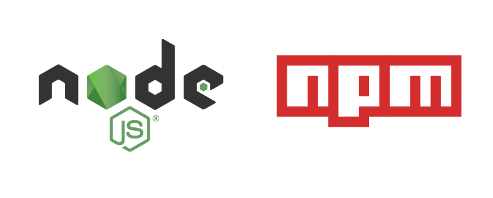

Node.js 에서는 간단한 모듈 불러오기 전략을 사용한다. require()로 모듈을 불러오면 다음과 같은 일들이 벌어진다.

- 제일먼저 코어 모듈인지 확인하고 로드한다.(Node에 기본 내장된 모듈, http 같은 모듈들..)
- 상대경로로 모듈이 require되었으면 그 모듈을 로드한다.
- node_modules의 외부 모듈을 찾는다. 만약에 모듈이 거기에 없으면 부모 디렉토리로 재귀적으로 찾는다.

> 환경변수 NODE_PATH를 지정하면 노드가 모듈을 어디서 찾게 할지 지정할 수 있으나 추천하지 않는다.


# Local Module 로드하기
`npm link`를 사용하면 내 컴퓨터에 있는 로컬 모듈들을 불러올수있다.

예를 들어 깃헙에서 다음과 같은 프로젝트를 `clone`했다.

```shell
git clone git@github.com:klughammer/node-randomstring.git
```

그런다음에 이 randomstring 프로젝트의 루트로 이동해서 `npm link`를 실행하면 글로벌 심볼 링크(파일 바로가기 만들기)가 생성되고,

```shell
cd ~/Desktop/node-randomstring

npm link
```

내 프로젝트 루트로 이동해서 `npm link randomstring`을 하게 되면 아까 내 컴퓨터에 `clone`받은 `randomstring` 모듈을 내 프로젝트로 불러올수있다.

```shell
cd ~/Desktop/my-project

npm link randomstring
```

그런다음에 내 프로젝트에서 불러온 `randomstring`모듈을 require()해서 각 파일에서 사용하면 된다.

```javascript
# ~/Desktop/my-project/app.js

const randomstring = require("randomstring");
console.log(randomstring.generate());
```

__어떻게 보면 파일의 바로가기를 만들어서 가져오는것과 비슷한 느낌인것 같다.__  
그렇기 떄문에, `clone`한 `randomstring` 프로젝트에서 다음과 같이 그 모듈을 수정했을때 내 프로젝트에서의 `randomstring`도 같이 수정되어있을것이다.  
왜냐면, 심볼릭 링크로 연결되어있기 떄문이다.(파일 바로가기로 연결됬기 떄문에 파일을 수정하면 바로가기도 당연 수정됨.)

```javascript
# ~/Desktop/node-randomstring/lib/randomstring

exports.generate = function(){
  return 4; // chosen by fair dice roll.
            // guaranteed to be random.
}
```

# 심볼릭링크는 어떤 경우에 유용한가?
다음과 같은 상황을 상상해보자.  
내가 만든 어떤 npm 모듈이 있다. 이건 B라는 폴더에 저장되어 있고, 지금 내가 작업하고 있는 또다른 노드 모듈이 있는데 이건 A라고 해보자.
그리고 A에서 B를 사용하고 있다고 해보자.

이런 상황에서 B에 있는 npm 모듈을 업데이트 했다. 그럼 바로 A에 반영되느냐? 아니다.  
B에 있는걸 다시 npm 저장소로 publish해야하고 그걸 다시 A에서 install을 다시 해줘야 한다.  
이런 상황에서 `npm link`를 사용하면 B에서 업데이트한게 A에도 바로 반영되기 때문에 간편하다.

B와 A가 모두 작업됬을때 둘다 한번에 publish해버리면 위 과정 보다 훨씬 편할것이다.


# 출처
https://medium.com/@alexishevia/the-magic-behind-npm-link-d94dcb3a81af