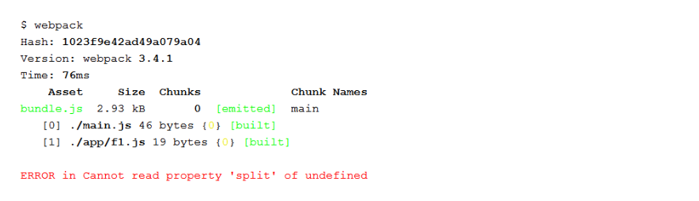
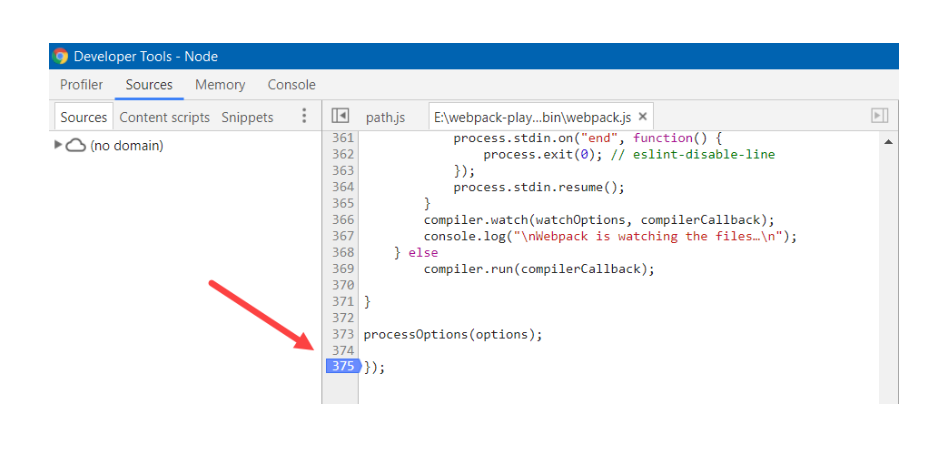
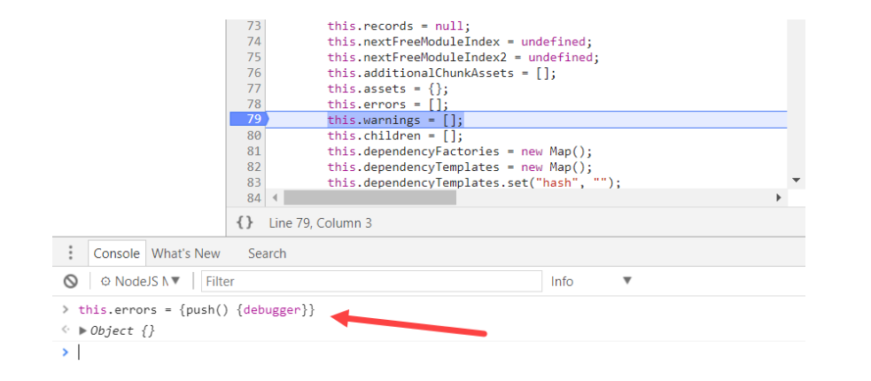

웹팩 플러그인을 붙이다보면 많은 오류를 만나게된다. 심지어, 많은 플러그인들이 문서화가 제대로 안되있는 경우가 많아서 디버깅을 해야 하는일이 생긴다.  
미리미리 웹팩을 디버깅하는 방법을 알아두면 큰 도움이 될것이다.

# 웹팩은 친절하지 않다.

웹팩은 위와 같이 어디에서 에러가 발생한건지 정확한 위치를 알려주지 않는다.
오류를 찾기 위해서 플러그인을 하나씩 제거하면서 찾아내야 하는데 이건 굉장히 비효율적이다.

# 에러가 왜 발생하는가?
디버깅 하는 방법을 살펴보기 전에 왜 에러가 발생하는지부터 살펴보자.

아래와 같이 파일을 읽어서 그 파일안에 `Hello Wolrd!`라는 String이 있는지 없는지 판단하는 플러그인을 만들어보자.

```javascript
plugins: [
   new HelloWorldCheckerPlugin({path: 'toinspect.txt'})
]
```

얼핏보면 위 플러그인은 사용하기 매우 간편해보이지만 내부적으로 `상대경로`가 아닌 `절대경로`를 사용한다는 말은 그 어디에도 나와있지 않다.  
보통 플러그인을 개인용도로 개발한다음 깃헙에 공개하기 떄문에 모든 상세한 부분을 문서로 남기지 않는 경우가 많다.


그래서 플러그인 구현대로 `절대경로`를 넣지 않고 `상대경로`로 잘못입력을 하게 되는 경우 위 사진처럼 에러가 발생하는데 왜 에러가 발생하는지 어디서 발생하는지 찾기가 힘들다.  

물론 toinspect.txt라는 파일에서 에러가 발생했다는것 정도의 정보는 알려주기 떄문에 HelloWorldCheckerPlugin에서 오류가 발생했다는것을 추측할수는있다.

__근데 다음과 같은 상황을 상상해보자.__  
1. 어떤 에러에서는 설명이 더 부실할수있다.
2. 만약 10개이상의 플러그인이 `toinspect.txt`라는 파일을 사용한다고 해보자. 그중 어떤 플러그인에서 에러가 발생했는지 알 수 있는가?
3. 그리고 이 `toinspect.txt`라는 파일은 플러그인 내부에서 사용될뿐만아니라 번들링된 JS파일에서도 사용될 수 도 있다.

과연 이런 상황에서, 저 부실한 에러메세지만으로 정확히 어디서 에러가 발생했는지 찾을 수 있겠는가? 운좋게 찾을수도있지만 대부분을 실패할것이다.
어디서 디버깅을 시작해야할지 난감하다. 웹팩이 적어도 정확히 어느 파일에서 에러가 발생했는지 알려줬으면 좋겠다. 하지만 웹팩은 그렇지 않다.

플러그인 제작자가 이런 에러에 대해서 명시해두지 않으면 매우 힘들다.

# 컴파일 에러
웹팩은 컴파일 과정에서 발생한 에러를 `Compilation.errors`라는 배열에 저장한다.
```javascript
class Compilation extends Tapable {
   constructor(compiler) {
      super();
        ...
      this.errors = [];  // 컴파일 에러 저장
```
우리가 방금 만든 플러그인을 포함한 모든 플러그인들이 컴파일 에러를 만나면 이 배열에 에러를 저장한다.

```javascript
_make(compilation, cb) {
    try {
       ...
    } catch (e) {
        compilation.errors.push(e);
        cb();
    }
}
```
위 코드는 우리가 만든 `HelloWorldCheckerPlugin`의 내부 메소드 `_make`이다.  
이 플러그인의 _make 함수에서 로그를 찍다가 에러가 발생하면 compilation.errors 배열에 에러를 push하게 된다. 

따라서 배열의 push 함수가 호출될때 브레이크 포인트를 걸고나서 콜스택을 조사하면 어디서 에러가 발생한건지 파악할 수 있다.

# 에러 배열에 push 함수 호출 인터셉트하기
노드를 디버깅하기 위해서 크롬을 사용하자. 나는 웹스톰에 내장된 노드 디버거보다 크롬 디버거를 더 선호한다. (빠르다)

[노드 크롬 디버거 설정하는 방법](https://medium.com/@paul_irish/debugging-node-js-nightlies-with-chrome-devtools-7c4a1b95ae27)

위 아티클을 읽고오면 노드 디버깅을 어떻게 하는지 알게 되었을것이다.
```bash
node --inspect-brk node_modules/webpack/bin/webpack.js
```
위 명령어는 node로 webpack을 실행시키는데, 실행 첫 단계에 브레이크 포인트를 걸겠다는뜻이다.(`--inspect-brk`)  
`--insepct` 옵션을 주게 되면 웹팩이 그냥 디버그 모드로 실행만 된다.(브레이크포인트는 내가 걸어줘야함.)

위 명령어를 입력하여 웹팩 실행 첫단계에서 멈춘다음에 크롬 개발자 도구에서 브레이크 포인트를 걸어놓고 디버깅을 해보자.

근데 매번 이렇게 긴 명령어를 입력하기 귀찮으니까 다음과 같이 별명을 주도록 하자.
```shell
alias dlwpc="node --inspect-brk node_modules/webpack/bin/webpack.js"
```
dlwpc = debug local webpack의 약자이다.

자 이쯤에서 위에서 했던 얘기를 한번만 더 복습하자.
```javascript
class Compilation extends Tapable {
   constructor(compiler) {
      super();
        ...
      this.errors = [];
```
`node_modules/webpack/bin/Compilation.js` 파일에 보면 위와 같은 클래스가 들어있고 이 객체의 생성자에서 errors라는 배열이 만들어진다.

웹팩은 빌드과정에서 컴파일에러가 발생하면 이 errors배열에 에러객체를 넣게된다. 즉 다음과 같은 함수를 웹팩이 호출시킨다.
```javascript
compilation.errors.push(e) // e는 에러 객체
```

그래서 이 `Compilation`객체에 정의된 `errors`배열에 `push`메서드를 재정의 해두면 내가 재정의한대로 push가 동작하게 된다.
```javascript
this.errors = []를
this.errors = {push() {debugger}} 이렇게 바꾼다.
```

그러면 웹팩이 컴파일 에러가 발생하여 this.errors.push할때 debugger가 실행되게 된다.  
한마디로 errors 배열에 push메소드가 실행될때마다 디버깅할수있다.

근데 이렇게 직접 파일을 찾아가서 수정해도되지만 나중에 다시 이 Compilation 객체를 찾아가서 오버라이딩된 this.errors를 되돌려줘야하니까 매우 귀찮다.  
그래서 그렇게 하지말고 첫줄에서 브레이크포인트 잡은다음에 크롬 개발자 도구에서 Compliation을 찾아가도록 하자.

```shell
dlwpc
```
이걸 실행하면 웹팩 실행 첫줄에서 멈춘다. 그리고 크롬에 들어가서 chrome://inspect를 입력한다.


위 사진을 보면 웹팩 실행 첫줄에서 멈춘것을 볼수있다. 이제 컨트롤+P를 눌러 Compilation.js 파일을 찾아가자.  
찾아가려고하면 파일을 찾을수없을것이다. 왜냐면, 웹팩의 빌드가 아직 끝나지 않았기 떄문이다.

여기서 두가지 방법이 있는데,  
첫번쨰는, `Compilation` 클래스의 생성자에서 `this.errors`를 오버라이딩 하고 재실행하기.
두번째는, 웹팩의 마지막에 디버그 포인트를 걸어놓고 실행하기이다.

나는 두번째 방법을 사용하겠다.


웹팩 마지막 부분에 디버그 포인트 걸어놓고 F8을 눌러 resume한다. 이떄는 모든 파일을 크롬 개발자도구에서 찾을수있다.


compilation.js파일 찾아가서 this.erros=[]가 정의된 바로 다음 부분에 디버그 포인트를 걸어서 멈추게 한다음에 콘솔에서 this.errors를 커스텀 객체로 변환시켜준다.


그리고 나서 resume을 하게 되면 this.errors에 push를 할때마다 디버그 포인트가 잡히게 되고 콜스택에서 어떤 플러그인의 어떤 위치에서 에러가 발생했는지 정확히 디버깅할 수 있다.


_make함수에서 에러가 났다는것을 확인했고,


콜스택을 따라 올라갔더니 정확히 뭐때매 에러가 났는지 확인할수있어졌다.


# 출처
https://medium.com/angular-in-depth/this-will-make-you-more-efficient-at-debugging-wepback-unspecified-build-errors-6392850caed9


