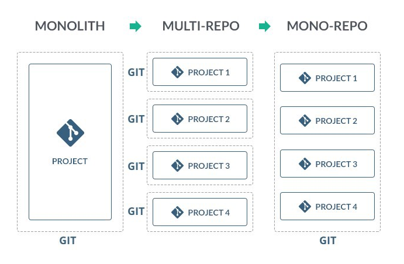

프로젝트 구조를 구성하는 방식 3가지가 위에 나와있다. `모놀리스`, `멀티레포`, `모노레포`이다. 

`모놀리스` 구조는 하나의 레포지토리안에 하나의 패키지안에 여러개의 서비스가 폴더로 구분된다.  
`멀티레포` 구조는 하나의 레포지토리안에 하나의 패키지안에 하나의 서비스가 들어간다.  
`모노레포` 구조는 하나의 레포지토리안에 큰 공통 패키지하나안에 여러개의 서브 패키지들(서비스)이 들어있다.

`모놀리스` 구조는 비슷한 여러개의 소규모 프로젝트들을 한번에 관리할때 좋은 구조인것같다.

`멀티레포` 구조는 서비스의 규모가 커서 각 서비스를 별도 관리해서 서비스간 의존성을 줄이고 싶을때 쓰면 좋은 구조인것같다. 마이크로 서비스 아키텍쳐라고도 불리는것같다.  

`모노레포` 구조는 마찬가지로 서비스의 규모가 커졌을때, 각 서비스간 분리도 되면서 공통 구조를 가져가고 싶을때 사용하면 좋을것같다.


# 모노레포
모노레포라는것은 1개의 `git repository`가 존재한다는 뜻이다.  
그 레포지토리안에는 하나의 큰 공통 패키지 안에 여러개의 서브 패키지가 들어있다.

# 모노 레포의 장점

## 1. 패키지별로 배포하기 쉬워진다.
모노레포의 서브 패키지 `A`와 `B`가 있다고 해보자. A패키지는 B패키지의 모듈을 가져와서 사용한다. 
이떄 A패키지에 새로운 기능을 추가하고나서 커맨드 한줄 입력하게되면 B패키지에 문제를 일으키지않고 A패키지가 배포된다.

## 2. 의존성 관리가 간편해진다.
하나의 공통 패키지안에 여러 서브 패키지들이 있기 떄문에 각 서브 패키지들이 공통으로 사용하는 의존성들은 공통 패키지에 넣으면 된다.
각 서브 패키지별로 다르게 사용해야하는 의존성들은 각 서브 패키지에 명시하면 된다.

멀티레포였으면 이렇게 여러개의 레포지토리에서 공통으로 사용하는 의존성 관리를 하기가 어려워진다.

## 3. 이슈관리가 간편해진다.
멀티레포였으면 각 레포지토리 별로 이슈가 분산된다. A와 B레포지토리 둘다에서 발생한 문제인데 어떤경우에는 A레포에만 이슈를 올리고 B는 빠트릴수가있다. 사람이 모든 레포지토리를 매번 관리하기가 힘들기 때문이다.
하지만 모노레포는 하나의 레포지토리에 모두 코드가 몰려있으므로 그 레포지토리에서 이슈를 생성하고 히스토리가 쌓이게 할 수 있다.

## 4. 각 서브 패키지가 독립적이면서, 서로를 공유할수있다.
__개인적으로 모노레포의 가장 큰 장점이라고 생각하는 부분이다.__ 각 서브 패키지들은 서로를 `심볼릭 링크`로 연결한다. 
이 `심볼릭 링크`로 연결되있는게 무슨 뜻이냐면, A서브 패키지의 수정사항이 B서브 패키지에 바로바로 반영된다는것이다.
각 패키지를 수정한다음에 배포하지 않고서도 로컬 컴퓨터에서 의존하고 있는 다른 패키지에 바로바로 반영되기 때문에 개발 생산성이 매우 올라가게 된다.

[심볼릭 링크에 대해서 알아보기](https://simsimjae.github.io/posts/TIL/10)

이걸 직접 구현할수도 있지만 `Yarn Workspace`나 `Lerna`를 사용하면 좀 더 간편하게 사용 할 수 있다.


# 모노레포 vs 멀티레포
멀티레포는 말그대로 레포지토리가 여러개 있다는 뜻이다. 레포지토리가 여러개면 좋은점이 있다. __바로 권한 관리를 레포지토리 별로 따로 할 수 있다는것이다.__
예를들어, 스타트업에서는 개발자가 빈번히 입사/퇴사한다. 이럴때 모노레포로 프로젝트를 만들어두면 개발자 한명이 회사의 전체 코드에 접근할수있게된다. 
근데 또 개발자들끼리 여러 프로젝트의 코드에 접근할수있다는게 어떻게 보면 장점이기도하다.

왜냐면 개발자 한명이 휴가를 가거나 부재했을때, 평소에 서로의 프로젝트를 크로스로 봐주고 있었으면 그 공백을 다른 개발자가 메꾸기 쉽기 때문이다.
__이런점은 모노레포의 장점이자 단점이라고 할 수 있다.__

반면에 멀티레포는 각 직원에게 필요한 레포지토리의 권한만 주어서 관리하게 할 수 있다는 장점이 있다.

모노레포가 멀티레포보다 좋은점은, __모노레포는 공통화가 쉽다는것이다.__ 서비스가 한두개일땐 상관없는데 이게 50개 100개가 되는경우에 멀티레포로 이 모든 서비스를 관리하게되면
굉장히 힘들어진다.

따라서, 모노레포로 프로젝트를 구성해두면 하나의 큰 패키지안에 여러개의 서브 패키지들로 서비스들을 관리할수있기때문에 멀티레포보다 훨씬 관리하기가 편하다.

이런 점들을 잘 고려해서 프로젝트 구조를 구성하면 될것같다.

> 추가로 멀티레포가 모노레포보다 좋은점을 알고계신다면 댓글로 알려주세요.

# 모노레포 구성

## Lerna
모노레포 구성을 쉽게 할 수 있도록 도와주는 라이브러리이다.
모노레포 안의 각 패키지를 묶어서 버전관리할지, 각 패키지마다 버전관리할지 등등을 정할수있다.

## Yarn Workspace
npm과 비슷한 패키지 매니저인 Yarn에서 Workspace기능을 제공한다.
이것을 사용하게되면, 모노레포의 각 패키지안에 있는 `node_modules`가 프로젝트 루트의 `node_modules`를 참조하게 된다.

Yarn에서 WorkSpace란 패키지와 동의어로 사용된다. 각 서브패키지들이 독립적이므로 어떤 프로젝트에는 타입스크립트 빌드 설정파일인 tsconfig.json을 넣을수도 있고 다른 서브 패키지에서는 그냥 js로 구성할수도있다.

Yarn Workspace에서는 각 서브 패키지들의 의존성이 모두 루트에서 관리된다.  관리 자체는 루트에서 되지만 각 서브패키지별로 의존성 재설치는 할 수 있다.
하지만 Lerna는 각 패키지별로도 관리하고 루트에서도 관리한다. 이런점이 두 라이브러리의 차이점이라고 할 수 있다.


# Lerna로 모노레포 구성해보기
`Lerna`를 사용해서 모노 레포를 구성해보면 다음과 같은 프로젝트 구조가 생긴다.
```markdown
mylerna_repo/
  - node_modules
  - packages

    - sub_package1
      package.json

    - sub_package2
      package.json

    - sub_package3
      package.json

  lerna.json
  package.json // 루트 패키지
```
`mylerna_repo`라고 하는 하나의 큰 레포지토리안에 루트 패키지 하나가 존재한다. 그 루트 패키지 안에는 `packages`폴더로 구분된 여러개의 서브 패키지들이 들어있다.
각 서브 패키지에 들어있는 `package.json`으로 독립적인 의존성 관리가 가능해진다. 공통으로 관리되는 의존성은 루트의 `package.json`으로 관리된다.

온라인 IDE로 유명한 [코드 샌드박스](https://github.com/despeauxz/codesandbox)는 `Yarn Workspace`와 `Lerna`를 혼합해서 사용하고 있다.

`Lerna`는 다음과 같은 두가지 방법으로 사용할 수 있다.

1. NPM 저장소에 push없이 사용하기
2. NPM 저장소에 push하면서 사용하기

첫번째 방식을 사용하게 되면 각 서브 패키지들을 `심볼릭 링크`로 연결해서 사용한다. 이걸 `Lerna`가 자동으로 처리해주기 때문에 내가 신경쓰지 않아도 된다.

두번쨰 방식을 사용하게 되면 __import { something } from @name/packagename;__와 같이 NPM 저장소에 올라가있는 패키지를 받아오기 떄문에 패키지를 매번 수정하고 푸쉬하고 다시 받아와서 테스트를 해봐야 해서 번거롭다.

## lerna bootstrap 명령어 살펴보기
### 이 명령어는 왜 사용해야 하는가?
```js
mylerna_repo/
	node_modules/
	packages/
		A
			node_modules/
				B
			package.json
		
		B
			package.json
```

이런 프로젝트 구조가 있다고 해보자. A서브 패키지에서 B서브 패키지를 사용하고 있다. 이떄 그냥 A패키지에서 node_modules안에 있는 B패키지를 사용하게되면 B패키지의 내용이 수정됬을때 그 수정사항이 반영되지 않은채로 실행된다.
그래서 의존관계에 있는 A와 B패키지를 로컬 컴퓨터에서 서로 `심볼릭 링크`로 연결해야 한다. 

만약 `mylerna_repo`에 100개의 서브 패키지가 있다고 해보자. 이거 일일이 `심볼릭 링크`로 연결할 자신이 있는가? 어마어마하게 귀찮은 작업이 될것이다. 실수할수도 있다.

그렇기 떄문에 `lerna bootstrap`명령어를 사용해서 의존관계에 있는 서브 패키지들을 서로 `심볼릭 링크`로 연결을 먼저 해주고 웹팩으로 빌드해야한다.


# 출처
https://medium.com/@deptno/monorepo-yarn-workspace-e81e3e078100  
https://medium.com/@patrickleet/mono-repo-or-multi-repo-why-choose-one-when-you-can-have-both-e9c77bd0c668  
https://levelup.gitconnected.com/moving-from-multiple-repositories-to-a-lerna-js-mono-repo-faa97aeee35b


