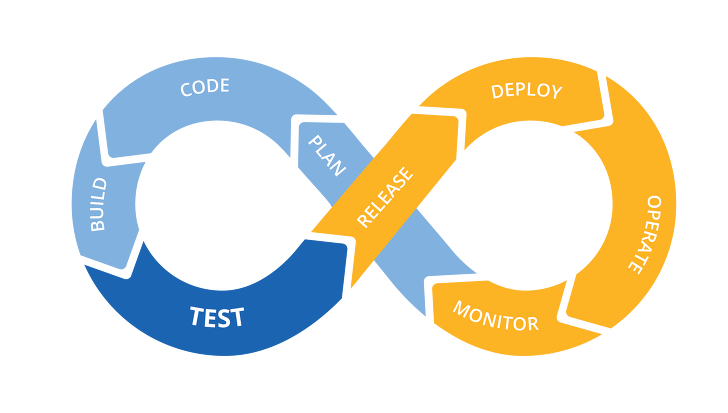

그동안 DevOps란 말을 들어만 봤지 정확히 이게 어떤 의미인지를 제대로 알지 못해서 이 기회에 한번 정리해보기로 했다.

# DevOps
회사에서 개발을 하다보면 개발만 한다고 되는것이아니다. 프로젝트를 빌드하고 배포하고 테스트하는 운영 업무도 같이 해야 한다.
보통 회사에서는 이 두개의 일을 하는 조직을 나눠서 관리하게 된다. 그런데 하나의 서비스를 두개의 팀에서 관리하다보면 비효율적인 부분들도 많고 서로 의사소통하기에도 좋지 않다.

`개발자`는 계속해서 새로운것을 도입하고 싶어하지만, `Ops`들은 안정성을 최우선으로 여긴다.
그래서 등장한것이 `DevOps`이다. 
__이 DevOps라는 개념은 소프트웨어 개발 방법론 중 하나이다.__

`개발자`들과 `Ops`들을 서로 잘 융합시키고 의사소통이 원할하게 하기 위한 개발 방법론이다.

# DevOps의 특징들
## Cross Functional Team
하나의 팀에 개발 부터 운영까지 모두 할 수 있는 사람들로 채우라는뜻이 아니라, 각 프로세스의(__개발 ~ 배포 및 테스트까지__) 담당자들을 하나의 팀으로 모으라는 뜻이다.
서비스 기획부터 개발 운영 테스트 배포등 모든 제품 개발 프로세스를 하나의 팀에서 할 수 있도록 해야 한다는것이 `Cross Functional Team`이다.

## Widely Shared Metrics
한마디로, 팀원 모두가 알고있는 하나의 공유된 지표가 필요하다는것이다.

서비스를 개발만 하는게 아니라 서비스가 운영에서 잘 돌아가고 있는지, 사용자의 반응은 어떤지를 측정할 수 있는 기준이 필요하다는것이다.
그리고 이 지표를 기준으로 팀원들이 아 `우리 서비스가 이정도로 잘돌아가고있구나`, 아니면 `아 이부분은 좀 부족하구나`라는걸 인지할 수 있도록 해야한다.

## Automating repetitive tasks
반복적인 일들은 자동화 하라는것이다. CI/CD를 이용해서 `빌드`-`배포`-`테스트` 프로세스를 자동화 해야한다.
반복작업에 투입되는 시간을 줄여야 좀 더 생산적으로 일할수 있고 좀 더 고도화된 서비스를 만들 여유와 시간을 벌 수 있을것이다.
고급인력들을 데려다 놓고 반복작업에 시간을 쏟게 하는것은 개인적으로나 회사 전체로보나 손해이다.
__그리고 자동화 툴을 만드는 과정에서 시스템 전체에 대한 이해가 높아진다. 여러모로 장점이 많다.__

## Post Mortems
직역하자면 `후처리`라고 할 수 있다.
장애나 이슈가 있을때 그걸 혼자만 알지 말고 팀원들과 공유를 해야한다.
서비스를 운영만 하다보면 어떤 이슈가 있을때 이 이슈가 얼마나 큰 이슈인지를 파악하지 못할떄가 많다.

## Regular Release
짧은 주기의 정기 배포를 통해서 빠르게 서비스의 기능을 개선하고 고객들의 VoC를 반영해 나가야한다.

# 우리 회사는 어떠한가
지금 내가 재직중인 회사는 `DevOps` 개념을 도입하지 않았다.
`Operation` 팀과 개발팀이 서로 분리되어 있으며, 의사소통이나 협업에도 어려움을 겪고 있다.

내가 겪었던 예시를 하나 소개하자면, 
우리팀의 작업방식은 리소스파일들을 git에 커밋하고나서 총 4개의 서버에 FTP로 수동 업로드를 하는 방식을 채택하고 있다. 그런데, CSS 한줄 수정해도 이 모든 과정을 되풀이 해야 해서 굉장히 비효율적이라고 느꼈는데,
이것을 개선해보고자 자동 FTP 업로드 라이브러리를 찾아서 적용해보려고 하던 찰나에, 총4대의 서버중 2대의 서버는 터미널 로그인이 가능하지만 나머지 2대의 서버는 그렇지 못했다.

이걸 가능하게 하려면 내가 직접 그 팀의 높은 권한을 가진분께 수정 요청을 해야하는데 나같은 신입이 그렇게 요청하기가 굉장히 부담스럽고 요청을 한다고해서 받아들여질것 같지도 않았다.

만약에 하나의 팀에서 운영조직과 개발조직이 같이 묶여있었다면 이런 요청을 하기가 덜 부담스러웠을것이고, 좀 더 다양한 시도들을 하는것이 가능했을것이라고 생각한다..

우리 회사의 발전과 함께 개인의 성장을 위해서 이런 개발 문화가 좀 더 잘 정착되었으면 좋겠다.

