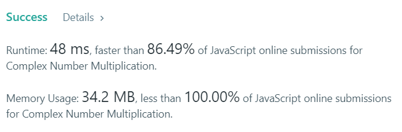

# 문제

Given two strings representing two complex numbers.

You need to return a string representing their multiplication. Note i2 = -1 according to the definition.

Example 1:
Input: "1+1i", "1+1i"
Output: "0+2i"
Explanation: (1 + i) _ (1 + i) = 1 + i2 + 2 _ i = 2i, and you need convert it to the form of 0+2i.
Example 2:
Input: "1+-1i", "1+-1i"
Output: "0+-2i"
Explanation: (1 - i) _ (1 - i) = 1 + i2 - 2 _ i = -2i, and you need convert it to the form of 0+-2i.
Note:

The input strings will not have extra blank.
The input strings will be given in the form of a+bi, where the integer a and b will both belong to the range of [-100, 100]. And the output should be also in this form.

# 풀이

주어진 문자열에서 기호 다빼고 숫자만 저장한다음에 곱셈을 하고 다시 기호나 i를 붙여주면 된다.

```javascript
/**
 * @param {string} a
 * @param {string} b
 * @return {string}
 */

const getArray = str => {
	// 1+-1i
	const array = [];
	let temp = "";
	for (let i = 0; i < str.length; i++) {
		if (str[i] === "+" || str[i] === "i") {
			array.push(temp);
			temp = "";
		} else if (str[i] === "-") {
			temp += str[++i] * -1;
		} else {
			temp += str[i];
		}
	}
	return array;
};

var complexNumberMultiply = function(a, b) {
	const arr1 = getArray(a); // 1, -1
	const arr2 = getArray(b); // 1, -1
	const resultArr = [arr1[0] * arr2[0], arr1[0] * arr2[1], arr1[1] * arr2[0], arr1[1] * arr2[1]];
	const subStr = resultArr[1] + resultArr[2] + "i";
	const sum = resultArr[0] + resultArr[3] * -1;
	const resultStr = sum.toString() + "+" + subStr;

	return resultStr;
};
```

# 결과



# 출처

https://leetcode.com/problems/complex-number-multiplication/
