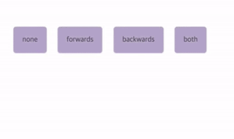
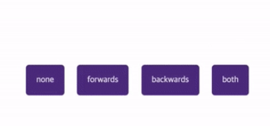
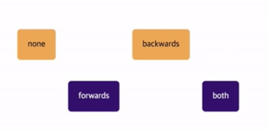

# 트랜지션의 특징

```css
div {
  width: 100px;
  height: 100px;
  background: #777;
}
div:hover {
  width: 200px;
  height: 200px;
  background: yellow;
}
div {
  transition: width 0.5s; /* width값이 변하면 0.5초동안 width값을 부드럽게 변화시키겠다. */
}
```


마우스를 올리기전엔 박스가 이런 모양이다.

마우스를 올리고난 후엔 박스가 커지며 백그라운드가 노란색으로 변경된다.

`transition` 속성에 `width`값이 변할때 `0.5s`동안 변화시키겠다를 지정했기 때문에 마우스를 올렸을때 부드럽게 변화한다.
만약에 `width`값 뿐만아니라 div의 다른값이 변했을때도 애니메이션 효과를 주고 싶다면 `transition: width 0.5s;` 대신 `transition: all 0.5s;`라고 지정하면 된다.

## 트랜지션을 트리거 하는 방법

1. 위처럼 기본 `CSS`가 적용된 상태에서 `가상선택자`를 추가해서 적용된 `CSS` 속성 변경
2. `div`에 새로운 클래스명을 주어서 `div`에 새로운 `CSS`를 적용

> 이처럼 transition은 같은 대상을 지칭하는 서로 다른 CSS rules(div와 div:hover)이 있고 어떤 속성(width)이 변경됬을때 transition(0.5s)이 트리거 될것인지를 지정해야한다.

`A`와 `B`라는 CSS규칙이 2개가 있을때 A의 어떤속성이 변경됬을때 B로 변경시킬건지 지정하는것이 `transition: ...` 이다.
위 예제에선 `width`값이 변경되었을때 `A` CSS에서 `B` CSS로 `0.5s` 동안 스타일이 변경되게끔 설정했다.

`transition: width 0.5s;`

**딜레이를 주고 싶으면 transition: width 0.5s 1s; 와 같이 적용하면 된다. 마지막 1s는 1초뒤에 트랜지션이 실행됨을 의미한다.**

# 애니메이션의 특징

애니메이션은 다음과 같이 사용하면 된다.

```css
/* 키프레임 이름 = 애니메이션 이름 */
@keyframes animationName {
  0% {
    left: 100px;
  }
  100% {
    left: 300px;
  }
}

/* 단일 속성 */
.object {
  animation-name: animationName; /* 키프레임의 이름 */
  animation-duration: 2s; /* 애니메이션 지속시간 */
  animation-delay: 1s; /* 애니메이션이 몇초 뒤에 실행? */
  animation-direction: alternate;
  /* 애니메이션을 0% -> 100%으로만 실행할건지? 100% -> 0%로 실행할건지? 아니면 0% -> 100% -> 0% 반복할건지?(alternate) */
  animation-iteration-count: 3; /* 몇번 애니메이션을 반복할건지? */
  animation-play-state: paused; /* 시작할때 멈춤 상태 */
  animation-timing-function: 1s; /* 어떤 타이밍 함수로 애니메이션을 실행할건지 */
  animation-fill-mode: both; /* 아래 참고 */
}

/* 속기형 */
animation: name | duration | timing-function | delay | iteration-count | direction | fill-mode | play-state> [, ...];
```

## animation-fill-mode

`none`, `forwards`, `backwards`, `both` 4가지 값이 존재한다.

1. `none`: 아무것도 지정하지 않는다.
2. `forwards`: 키프레임 100%에 도달했을때 그 상태를 유지한다.
3. `backwards`: 애니메이션이 시작하기도 전에 미리 키프레임 0%의 상태를 유지한 상태로 대기한다. 또한 애니메이션이 끝나면 처음 상태(키프레임 0%상태X)로 돌아온다.
4. `both`: `forwards`와 `backwards` 둘다 적용한다. (대기중일때 미리 키프레임 0%의 상태를 유지하며 키프레임 100%가 됬을때 그 상태를 유지한다.)

## 좀더 이해하기 쉽게 정리해보자.

CSS가 총 3개가 존재한다고 해보자. `처음적용된 CSS`, `키프레임 0%의 CSS`, `키프레임 100%의 CSS`

애니메이션이 실행되는 동안 CSS가 다음과 같이 적용된다.

`애니메이션 실행전(처음CSS)` - `애니메이션 실행 직후(키프레임 0%)` - `애니메이션 실행 완료(키프레임 100%)` - `애니메이션 실행 종료`의 4단계로 구분해보았다.

`none` : 처음 -> 0% -> 100% -> 처음

`forwards`: 처음 -> 0% -> 100% -> 100%

`backwards`: 0% -> 0% -> 100% -> 처음

`both`: 0% -> 0% -> 100% -> 100%

아래 이미지에 보면 4가지 블록이 존재하는데 기본적으로 4개의 블록에 적용된 배경색은 **주황색이다.**

키프레임이 `0%`일때 배경색이 **연보라색이며,**

키프레임이 `100%`일때 배경색은 **진한보라색이다.**


처음에 `none`과 `forwards`는 주황색(기본으로 적용된 CSS)이고 나머지는 연보라색(키프레임 0% CSS가 적용됨)이다.


그리고 나서 애니메이션이 시작됨과 동시에 4개의 블록 모두 연보라색으로 변경된다.
키프레임 0%에 적용된 CSS가 `background: 연보라` 이기떄문이다.


키프레임 100%에서 4개의 블록 모두 진한 보라색으로 변경된다.


키프레임 100%에서 조금 시간이 지나면(애니메이션이 종료되면) `none`과 `backwards`는 다시 처음상태로 돌아간다.
`backwards`라는 이름에서 유추할수 있듯이, **다시 되돌아간다 라고 기억하면 될것같다.**

하지만 `forwards`와 `both`는 키프레임 100%의 CSS가 적용된 상태로 유지된다.
`forwards`라는 이름에서 유추할 수 있듯이, **앞으로 전진된 상태 그대로를 유지한다고 기억하자.**

`both`에는 `forwards`가 포함되어있으니까 이것도 당연히 마지막 상태가 유지된다고 이해할수있다.

> 애니메이션이 역방향으로 진행될때 timing function도 역으로 적용된다. 속도가 빠르다가 느려지는 애니메이션이 역방향으로 진행되면 느리다가 빨라진다.

# CSS Animation VS Transition

그래서 애니메이션과 트랜지션의 차이점이 뭔데? 라고 생각할 수 있다.

애니메이션이 실행되는동안,

트랜지션은 `A`라는 상태와 `B`라는 상태 딱 두가지의 상태만 적용할수있다.
반면에, 애니메이션은 `A`,`B`,`C`,`D`..등 여러가지의 상태를 적용할수있다.

또한 트랜지션은 애니메이션을 반복하거나 애니메이션이 끝난 상태를 유지한다던지 뭐 이런 고급기능들을 사용할 수 없다.

또한 트랜지션은 새롭게 클래스명을 추가하던지 마우스를 `hover`하던지 해당 엘리먼트의 속성에 변경이 일어나야만 애니메이션이 시작되는데,
애니메이션은 그냥 시작 시킬 수 있다.

그래서 간단하게 요약해보자면, `트랜지션`은 간단하게 애니메이션을 사용하고 싶을때 사용하고 좀 더 디테일하게 애니메이션을 다뤄야 한다면 `키프레임`과 함께 `CSS애니메이션`을 사용하도록 하자.
