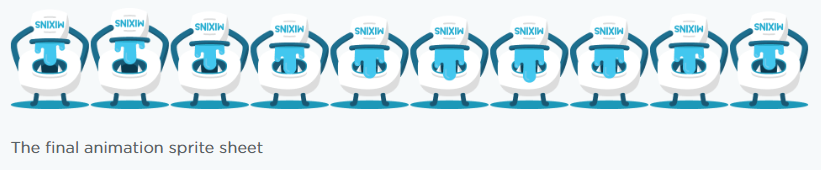

CSS 애니메이션을 단계별로 끊어서 실행시키는 방법은 잘 알려져있지 않다. CSS 스프라이트 내의 이미지와 이미지 사이의 빈 공백은 보여주고 싶지 않으며 스프라이트 이미지를 하나의 프레임으로 취급해서 부드럽게 애니메이션을 적용할 수 있다.

위 사진을 보면 하나의 스프라이트 이미지 내의 이미지 사이사이가 키프레임에 포함되서 빈 공백 부분이 보여지는것을 알 수 있다. 우리는 이런 효과를 원하지 않는다.

# steps()로 애니메이션하기

이 함수를 사용하면 애니메이션을 몇개의 `keyframes`으로 실행하게 할지 조절할 수 있다.

# 애니메이션 만들기


이런 190x240짜리 PNG 스프라이트 이미지가 있다.

```css
.monster {
  width: 190px;
  height: 240px;
  background: url("monster-sprite.png") left center;
} /* 몬스터 1마리의 크기만큼 width와 height 설정 */

@keyframes play {
  100% {
    background-position: -1900px;
  }
}
```

몬스터가 총 10마리가 있으므로 최종 100%의 백그라운드 포지션은 -1900px이어야 한다. 백그라운드 이미지는 왼쪽으로 이동하면서 화면에 보여지게 된다.

# 애니메이션 실행하기

```css
.monster {
  ... animation: play 0.8s steps(10);
}
```

위에서 정의한 `play keyframes`를 0.8s 동안 실행되게 했다. 근데 여기서만 끝나는게 아니라 몬스터 10마리를 스텝별로 끊어줘야 하므로 `steps(10)`함수를 사용했다.

그럼 다음과 같이 몬스터가 물을 벌컥벌컥 마시는 애니메이션이 완성된다.
https://codepen.io/Guilh/pen/yldGp

# 출처

https://blog.teamtreehouse.com/css-sprite-sheet-animations-steps
