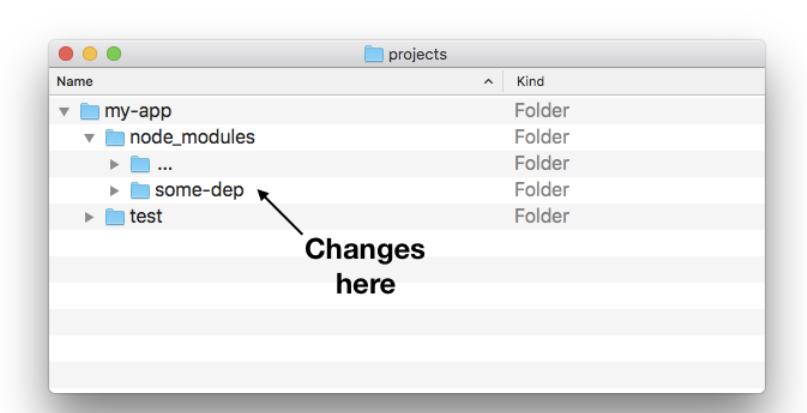
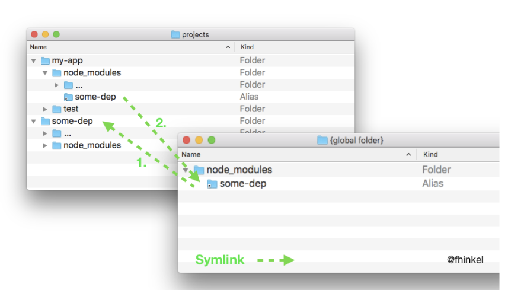

때떄로, 내 프로젝트 코드 뿐만아니라 외부에서 불러온 패키지 모듈도 같이 살펴봐야 할 때가 있다.
내가 지금 새로운 노드 모듈을 만들고 있는데 이 모듈에 대한 테스트를 아직 못끝냈다고 해보자.

이럴때 새롭게 만들고 있는 노드 모듈을 또 다른 내 프로젝트에 설치(`npm install`)한 다음에 테스트해볼수있다. 이때 문제가 생기면 외부 모듈과 내 프로젝트를 동시에 디버깅해봐야한다.


내가 테스트하고 있는 모듈이 `some-dep`이라고 해보자. 이 모듈은 `my-app` 모듈의 외부 모듈로 설치되어있는 상태이다.

이 상태에서 `some-dep`을 수정한 다음에 `some-dep`의 깃에 커밋하고 푸쉬해서 반영할수도 있지만 좀더 간편한 방법이 있다. 바로 `npm link`이다.

# 사용법

`npm link`는 서로 다른 두개의 패키지를 로컬 컴퓨터 내에서 연결한다. 연결 과정은 다음과 같다.

-   `some-dep`에서 `npm link`를 실행하면 `global symlink`가 생성된다.
-   내 프로젝트 `my-app`에서 `npm link some-dep`을 실행하면 방금 생성한 `global symlink`를 사용할 수 있게 된다.


위 그림을 보자.

-   projects폴더에는 `my-app`과 `some-dep` 두개의 모듈이 존재한다.
-   `some-dep`모듈에서 `npm link`를 실행하면 `{global folder}`에 `global symlink`가 생성된다.
-   이번엔 `my-app` 모듈에서 `npm link some-dep`을 실행하면 방금전에 생성한 `global symlink`를 `my-app`에서 바로가기로 사용할수있게된다.

즉 `npm link`와 `npm link <모듈이름>` 두가지 커맨드를 사용해서 `global symlink`를 통해 서로 다른 두개의 패키지를 연결하는것이다.

내가 `some-dep` 모듈을 만들면서 테스트중인데, 이 모듈을 수정하면 `my-app`에 들어가있는 `some-dep`도 같이 수정되기 때문에 모듈 테스트가 훨씬 간편해진다.  
이것은 `git`에는 커밋되지 않고 로컬 컴퓨터에서만 유효하다. 그렇기 때문에 테스트를 마무리하고 나서는 꼭 `publish`를 해줘야 한다.

# 다시 원래대로 되돌리기

만들고 있는 `some-dep`에 대한 테스트가 끝났으면 이제 만들었던 `global symlink`를 제거해줄 차례이다.
`npm unlink`는 `npm uninstall`과 똑같은 커맨드이므로 주의하자.

my-app에 global symlink로 연결했었던 some-dep을 제거해주자.

```bash
cd ~/projects/my-app

npm uninstall --no-save some-dep && npm install
```

이번엔 global symlink를 제거해주자.

```bash
cd ~/projects/some-dep

npm uninstall  # Delete global symlink
```
