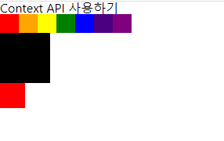
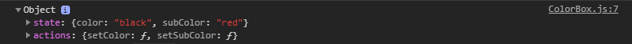

> 위 예제는 다음 레포지토리에 저장되어있습니다.  
> 1. git clone https://github.com/simsimjae/react_practice.git  
> 2. get reset --hard 6425494561510d85fc7fb098ba4256e1d59f2fbd  
> 3. yarn start or npm run start 실행

# 서론
이전 버전에서는 리액트만으로 상태관리하기가 굉장히 힘들었다.  부모와 자식간의 상태 교환만 가능했기 때문에 프로젝트 규모가 커질 수록 상태관리가 어려워 유지보수 하기가 점점 어려워진다.

이걸 극복하기 위해서 `Redux`나 `Mobx`를 사용하는데 이런 상태관리 라이브러리들의 기반이 되는 리액트의 `Context API`를 살펴보자.
리액트 16.3 이후 버전부터 이 `Context API`가 사용하기 쉽게 개편됬다고 한다.

그래서, 지금은 단순히 전역상태 관리만 필요한 프로젝트라면 리덕스를 굳이 쓰지 않아도 괜찮은것같지만, 나중에 비동기 처리를 하게 될지도 모르기 때문에 그냥 처음부터 리덕스를 쓰는게 나은것같다.(개인적인 의견)

# 정적 Context 사용해보기
### `src/contexts/color.js`

먼저 저장창고 역할을 하는 Context를 만들어보자.

```jsx
const ColorContext = createContext({ color: "black" }); // 저장창고(Context)에 검정색 저장
```

### `src/components/App.js`

```jsx
<ColorContext.Provider value={{ color: "red" }}>
	<div>
		<ColorBox />
	</div>
</ColorContext.Provider>
```

원래 색상 저장 창고에는 검정색이 들어있었다. 그런데, 판매자 `Provider`씨는 color를 red로 바꿔버렸다.
판매자가 갑이기 때문에 색깔을 빨간색으로 바꾸면 구매자는 그 바뀐 빨간색을 살 수 밖에없다.
여기서 소비자는 `ColorBox`이다. 판매자는 `ColorContext.Provider`이다.

__Provider가 변경한 정보(value={}부분)는 Provider의 자식들(ColorBox)에게 모두 영향을 미친다.__


### `src/components/ColorBox.js`

```jsx
const ColorBox = () => {
	return 
		<ColorContext.Consumer>
			{
				({ color }) => 
					<div style={{ width: "64px", height: "64px", background: color }}></div>
			}
		</ColorContext.Consumer>;
};
```

저장창고에 들어있는 색상을 꺼내온다.
`Consumer(소비자)`는 `Provider(판매자)`가 저장창고에서 꺼낸 색상을(기본은 검정색인데, 판매자가 방금 빨간색으로 바꿈) 구매해서 `div` 박스에 페인트칠을 한다.

# 동적 Context 사용하기
> git reset --hard ffa88aa070b4fd87424e9e552b6815fdf3059612


위에 빨주노초파남보중 하나를 왼쪽 클릭하면 아래에 큰 상자의(기본 검정색) 색깔이 바뀌고 오른쪽 클릭하면 맨아래 작은 상자(기본 빨간색)의 색깔이 바뀌는 예제이다.

탑다운방식으로 살펴보자.

### `src/App.js`

```jsx
<ColorProvider>
	<div>
		<SelectColors />
		<ColorBox />
	</div>
</ColorProvider>
```

컬러 판매자(`Color Provider`)는 `SelectColors`와 `ColorBox`에게 색상을 판매하려고한다.

### `src/contexts/color.js`
```jsx
const ColorContext = createContext({
	state: { color: "black", subColor: "red" },
	actions: {
		setColor: () => {},
		setSubColor: () => {}
	}
});
// 색깔 저장소에는 두가지 컬러가 들어있고, 두가지 색상을 변경시킬수 있는 함수가 들어있다.

const ColorProvider = ({ children }) => {
	const [color, setColor] = useState("black");
	const [subColor, setSubColor] = useState("red");

	const context = {
		state: { color, subColor },
		actions: { setColor, setSubColor }
	};

	return <ColorContext.Provider value={context}>{children}</ColorContext.Provider>;
};
// 색깔 판매자의 상태와 창고의 상태(context)는 일치한다.
// 색깔 판매자로 감싸진 자식들(children)은 판매자 Provider가 제공하는 창고정보(context)에 접근이 가능해진다.
// Provider의 상태를 바꿔주면 창고의 상태도 같이 바뀐다.

const ColorConsumer = ColorContext.Consumer;

export { ColorProvider, ColorConsumer };
// 내보내진 ColorConsumer를 사용하면 Provider가 props로 context(창고)를 내려준다.
// 내보내진 ColorProvider를 사용하면 value="" 부분에 객체를 넣어서 context(창고)를 수정할 수 있다.

export default ColorContext;
```
컬러 판매자 `Provider`는 창고에 두가지 색상(검정색, 빨간색)을 미리 준비해뒀다.  
그리고 창고의 상태와 `Provider`의 상태를 일치시킨다. 다시말해서, __Provider가 가진 색상 정보가 변경되면 창고의 색상 정보도 같이 변경되게끔 구성했다.__

`children`에는 Provider로 감싸진 소비자 두명 `SelectColors`와 `ColorBox`가 들어오게 된다.  
이 두명의 소비자는 `Provider`가 제공하는 창고의 정보 `context`에 접근할 수 있으며 창고에 있는 색상을 변경시키는 `setColor`와 `setSubColor`도 사용할수있다.

그리고 나서 창고파일(color.js)에서 Provider, Consumer, Context (생산자, 소비자, 창고) 3개를 내보내준다.

### `src/components/SelectColors.js`

```jsx
<ColorConsumer>
	{context => (
		<div style={{ display: "flex" }}>
			{colors.map(color => (
				<div
					key={color}
					style={{ background: `${color}`, width: "24px", height: "24px", display: "inline-block", cursor: "pointer" }}
					onClick={() => {
						context.actions.setColor(color);
					}}
					onContextMenu={e => {
						e.preventDefault();
						context.actions.setSubColor(color);
					}}
				>
				</div>
			))}
		</div>
	)}
</ColorConsumer>
```

색상 구매자 `SelectColors`는 어떤색을 구매할지 결정하기 위해서 색상 판매자 `Provider`로부터 색상 창고(`context`)를 구경하기로 했다.(__Consumer내부 함수에서 context를 props로 받아오는 부분__)

__마우스 왼쪽클릭시,__ Provider로 부터 전달받은 context에 접근해서 Provider가 갖고 있는 컬러 정보를 바꿔준다. 
Provider와 창고(context)의 상태는 일치시켜져있기 때문에 Provider의 상태를 바꾸면 Context의 상태도 같이 바뀐다.

__마우스 우클릭시,__ Provider가 갖고 있는 두번째 컬러값이 변경된다.

# Consumer대신 Hook, static contextType 사용하기
> git reset --hard 0c86a557bdacee06203b529f018b2caa93155af1

위에서 봤듯이, Consumer를 사용하게 되면 코드가 길어지고 보기 힘들어 지는 느낌이 있다.
Consumer가 여러개 중첩되어 있을땐 더더욱 보기가 힘들어진다.

그래서 리액트에서는 `Consumer`대신 리액트 훅스에서 `useContext Hook`을 제공하고, 클래스 컴포넌트에서는 `static contextType`을 제공한다.
위에서 봤던 Consumer인 ColorBox를 다시 한번 살펴보자.

```jsx
<ColorConsumer>
	{context => (
		<>
			<div style={{ width: "64px", height: "64px", background: context.state.color }}></div>
			<div style={{ width: "32px", height: "32px", background: context.state.subColor }}></div>
		</>
	)}
</ColorConsumer>
```
Consumer를 사용하면 항상 이렇게 무언가를 감싸줘야 한다. 이 감싸주는거 자체가 가독성을 떨어뜨린다.

그래서 그렇게 하지말고, `useContext Hook`을 써보자.
```jsx
const context = useContext(ColorContext);

return (
	<>
		<div style={{ width: "64px", height: "64px", background: context.state.color }}></div>
		<div style={{ width: "32px", height: "32px", background: context.state.subColor }}></div>
	</>
);
```
훨씬 가독성이 좋아졌다.

우선 `<ColorConsumer>...</ColorConsumer>`로 자식을 감싸지 않아도 되고 안쪽 함수가 제거됬다.
우리가 미리 만들어둔 `ColorContext`(색상 창고)에 있는걸 가져다 쓰겠다고(`useContext`)선언만 해주면 창고에 있는 두가지 색상과 색상 변경 함수들을 사용할수있다.



실제로 useContext로 가져온 `context`를 콘솔에 찍어보면 위와 같이 창고에 저장된 정보가 보인다.

## static contextType
리액트 훅스에서는 `useContext`를 사용하면 되고, 클래스형 컴포넌트에서는 `static contextType`이라는걸 쓰면 된다. 지금은 훅스가 대세이므로 예제에는 넣지 않고
그냥 살펴만 보고 아 이런게 있구나 하고 넘어가도록 하자.

### `components/SelectColors.js`
```jsx
class SelectColors extends Component {
	static contextType = ColorContext; // 컨텍스트(창고) 조회

	render() {
		...
	}
}
```

클래스형 컴포넌트에서는 위와 같이 컨텍스트를 조회하면 된다. `this.context`로 클래스의 인스턴스에서 컨텍스트에 접근이 가능하다.

__클래스형 컴포넌트에서는 컨텍스트를 하나밖에 사용하지 못한다는 단점이 있다.__
그렇기 때문에 더더욱 훅스를 사용하길 추천한다.


