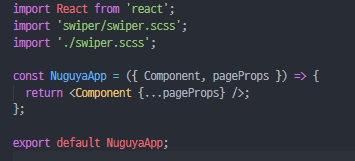

# 발견된 현상
pages 디렉토리에 `index.js`와 `about.js`가 있었다. about.js에는 swiper 컴포넌트를 가져와서 사용하고 있었는데 스타일링을 위해서 about.js에서 swiper.scss를 import해서
사용하고 있었다. 그런데 이 scss를 추가하자 갑자기 __메인페이지에서 about페이지로 Link컴포넌트(next/link)로 라우팅이 안되는 이슈가 발견되었다.__

# 원인 분석
진짜 이거때문에 삽질을 몇시간 동안 했는지 모르겠다. 이번 이슈 해결을 통해서 검색 해도 잘 안나오는 에러를 찾는 스킬이 좀 는 것같다.
우선 현재 작동하지 않는 버전을 커밋하고나서, 의심이 가는 파일, 문법 하나하나 지워가기 시작했다. 
그러다가 scss import한 부분을 제거하고 확인해보니 잘 작동하는걸로 봐서 이 부분이 문제라는걸 알게 되었다.
어디가 원인인지를 알아냈으니 이제 다시 `git reset --hard HEAD` 명령어를 입력해서 커밋을 되돌렸다.

# 해결
검색해보니 next.js를 사용할때 scss파일을 바로 페이지에 import시키게 되면 HMR(Hot Module Replacement)과 관련된 이슈가 발생한다고 한다.
나같은 경우엔 위처럼 라우팅이 정상적으로 동작하지 않았다. 그래서 scss파일은 `_app.js`에 import하라고 되있는 글을 발견했고 실제로 잘 해결 되었다.

`_app.js`는 넥스트가 CSR(Client Side Rendering)을 할때 사용하는 템플릿 js파일 같은 역할을 한다.
`_app.js`의 리액트 컴포넌트에 props로 Component(각 페이지에 해당하는 리액트 컴포넌트)와 pageProps를 넥스트가 넣어준다.
위 코드에서는 단순히 next가 넣어주는 Props들을 이용해서 페이지를 렌더링하고있다.