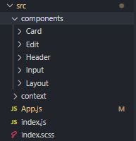
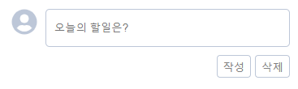
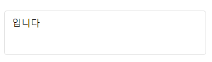
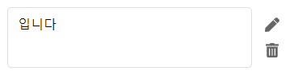

간단한 CRUD 기능이 있는 투두리스트를 만들어 보았습니다.
> demo : https://simsimjae.github.io/react_todolist

> 위 예제는 다음 레포지토리에 저장되어있습니다.  
> 1. git clone https://github.com/simsimjae/react_practice.git  
> 2. get reset --hard eb112599275f41f6594189a2e137fd9b1465c194  
> 3. yarn start or npm run start 실행

해당 프로젝트는 다음과 같은 특징이 있습니다.
1. 리액트 Context API를 활용한 State관리
2. React-Router를 사용한 클라이언트 라우팅

비동기 작업을 필요로 하지 않은 프로젝트기 때문에 굳이 리덕스를 사용하지 않고 Context API를 사용하였습니다.
또한 리액트 라우터에서 하위 라우팅을 사용해서 수정기능을 구현했습니다.

# 프로젝트 구조

컴포넌트들을 components폴더로 모았고, context 객체도 context폴더로 모았습니다. 또한 앱의 루트 컴포넌트로 App.js를 사용합니다.

# 투두리스트 작성 기능 구현

해당 부분은 Input 컴포넌트입니다. 작성 버튼을 클릭하면 아래 리스트에 카드가 추가 되어야 하고 삭제 버튼을 클릭하면 인풋이 초기화 되어야 합니다.

```jsx
<div className="todo">
	<form className="todo_form" onSubmit={handleSubmit}>
		<div className="todo_area">
			<FontAwesomeIcon icon={faUserCircle} size="2x" />
			<input className="todo_input" placeholder="오늘의 할일은?" value={input} onChange={e => setInput(e.target.value)} />
		</div>
		<div className="todo_footer">
			<button className="todo_button">작성</button>
			<button type="button" className="todo_button" onClick={() => setInput("")}>
				삭제
			</button>
		</div>
	</form>
</div>
```
input 컴포넌트의 jsx 부분입니다. input요소를 form으로 감쌌고 엔터를 누르거나 작성 버튼을 클릭했을때 onSubmit부분이 실행되어 handleEdit 함수가 실행됩니다.
button의 기본 타입은 submit이기 때문에 타입을 지정하지 않은 작성 버튼을 누르면 기본적으로 submit되고 삭제 버튼은 type="button"이기 때문에 눌러도 submit 되지 않습니다.
대신 onClick 이벤트 핸들러에서 input에 들어있는 문장을 클리어 해주고 있습니다.

```jsx
<input className="todo_input" placeholder="오늘의 할일은?" value={input} onChange={e => setInput(e.target.value)} 
```
인풋에서 글자를 입력하면 input state를 변경해주는 setInput함수가 실행됩니다. e.target == input이고 e.target.value == input에 입력된 텍스트 입니다.
따라서 위 onChange 이벤트 핸들러가 실행되면 우리가 입력한 텍스트들이 state에 반영되고 그 state가 변경되면 리액트는 해당 인풋 컴포넌트를 변경된 state로 리렌더링 합니다.
그래서 우리가 바꿔준 상태(입력된 글자)가 반영된채로 다시 그려지는것이죠.

```jsx
const Input = ({ edit, location, ...props }) => {
	const [input, setInput] = useState("");
	const useAppContext = useContext(AppContext);

	const handleSubmit = e => {
		e.preventDefault();
		if (!input.length) return;

		useAppContext.setList([{ inputText: input, id: nextId() }, ...useAppContext.list]);
		setInput("");
	};
	//... 
})
```
이제 인풋 컴포넌트의 윗부분을 살펴봅시다.
인풋에 입력될 텍스트를 저장할 state가 필요하기 때문에 input이라는 state와 그 state를 바꿔줄 setInput이라는 함수를 useState 훅스를 사용해서 선언해줬습니다.
useContext부분은 나중에 자세히 살펴볼건데 지금은 간단히 어떤 데이터를 저장하는 `중앙 저장 창고`라고 생각만 하고 넘어갑시다. useAppContext에는 우리 todolist 앱에서 사용되는 상태들이 들어있습니다.

아까 위에서 인풋에 글자들을 입력하고 엔터를 누르거나 작성버튼을 클릭하면 onSubmit이 실행된다고 했습니다. 그리고 그 onSubmit에서 handleSubmit을 실행시킵니다.
handleSubmit 내부를 살펴보면 인풋에 글자가 입력되지 않은 경우엔 아무일을 하지 않습니다.

```jsx
useAppContext.setList([{ inputText: input, id: nextId() }, ...useAppContext.list]);
setInput("");
```
이부분이 중요한데, 중앙 저장창고인 AppContext에는 투두리스트 목록이 list라는 변수 안에 배열로 들어있고 이 배열을 변경시키는 setList라는 함수가 같이 들어있습니다.
우리가 텍스트를 입력하고 작성 버튼을 클릭하면 중앙 저장 창고인 AppContext에 그 글자가 저장되어야 합니다. 
그래야 중앙 저장 창고가 변경 됬을때 이 창고를 바라보고 있는 다른 컴포넌트들이 업데이트되게 할 수 있습니다.

리액트에선 `Shallow Copy`를 하기 때문에 항상 불변성을 유지해줘야 합니다. 그래서 기존 AppContext.list에 들어있는걸 es6의 spread 연산자로 새로운 배열에 풀어주고(...useAppContext.list부분)
새롭게 추가되는 객체를 앞부분에 추가해줬습니다.(새롭게 작성한 투두리스트가 맨위에 렌더링 되게 해야함)
nextId()는 그냥 아이디를 랜덤하게 생성해주는 `react-id-generator`라는 모듈을 사용했습니다.
그리고 나서 인풋을 비워줘야 하기 때문에 setInput('');로 state에 저장된 text를 clear해줬습니다.

이 부분이 실행되고 나면 이제 저장 창고 AppContext에는 방금 우리가 입력한 투두가 투두 리스트 맨윗부분에 추가되게 됩니다.

# 투두리스트 조회 기능 구현
아까 위에서 우리가 작성한 투두는 중앙 저장창고인 AppContext에 저장된다고 했습니다.
그리고 이 창고에는 투두리스트가 list배열에 들어있다고 했습니다. 이 list 배열을 사용하려면 창고의 상태들을 제공해주는 `Provider`라고 하는 친구가 필요합니다.
Provider는 다음과 같이 구현되어 있습니다.

## src/context/AppContext.js
```jsx
import React, { useState, createContext } from "react";

const AppContext = createContext([
	{
		id: 0,
		inputText: "hello"
	}
]);

const AppContextProvider = ({ children }) => {
	const [list, setList] = useState([]);

	const context = {
		list,
		setList
	};

	return <AppContext.Provider value={context}>{children}</AppContext.Provider>;
};

export { AppContext, AppContextProvider };
```

이부분이 바로 리액트의 Context API를 사용한 부분입니다.
위에 부터 차례차례 살펴봅시다.
```jsx
const AppContext = createContext([
	{
		id: 0,
		inputText: "hello"
	}
]);
```
먼저 창고를 생성해줬습니다. 그리고 나서 창고에 어떤 데이터가 저장되어야 하는지 예시로 위 객체를 넣어뒀습니다. 
이 객체에는 투두리스트에서 각 투두를 구분할 수 있는 id값과 그 투두에 들어있는 문자열을 저장하는 변수 inputText가 들어있습니다.
이 AppContext는 단지 이 컨텍스트에 어떤 데이터들이 들어있는지 참고용으로만 사용됩니다.(아래에서 어차피 다시 빈값으로 초기화 됩니다.)
즉, 그냥 다음과 같이 써도 똑같이 동작합니다.
```jsx
const AppContext = createContext([]);
```
그다음은 Provider를 어떻게 구현하는지 살펴봅시다.
```jsx
const AppContextProvider = ({ children }) => {
	const [list, setList] = useState([]);

	const context = {
		list,
		setList
	};

	return <AppContext.Provider value={context}>{children}</AppContext.Provider>;
};

export { AppContext, AppContextProvider };
```
우선 투두리스트를 저장할 변수 list와 그 list를 변경해줄 setList를 useState 훅스로 선언해줬습니다.
그리고 나서 context라는 객체에 list와 setList를 담아줍니다.
그리고 이 값을 AppContext.Provider라고 하는 친구의 value속성으로 넣어주게 됩니다.
이 Provider의 value값으로 전달한 객체가 비로소 창고에 등록되는 진짜 데이터입니다. 우리가 위에서 예시용으로 만든 창고(컨텍스트)가 왜 이제 예시용인지 알겠죠?
Provider에 context를 넣어줬습니다. 이제 Provider로 감싸진 자식들은 이 창고에 저장된 context를 사용할 수 있습니다.

여기서 children은 Provider로 감싸진 자식들이 들어오게 됩니다. 예를들어
```jsx
<AppContextProvider>
	<span>나는 자식입니다.</span>
</AppContextProvider>
```
이렇게 되있으면 나는 자식입니다. 부분이 Provider의 children이라는 변수에 들어오게 되는것입니다.

여기서 궁금한게 생기실텐데 그냥 `AppContext.Provider`를 바로 export하면 되지 왜 굳이 한번더 감싼 `AppContextProvider`를 내보내지? 라고 생각하실겁니다.
__그건 바로 AppContext에 저장된 값을 자식컴포넌트에서 동적으로 변경 할 수 있게 만들어야 하기 때문입니다.__ 기본적으로 리액트의 Context API는 context를 __조회만 가능하고 수정할수가 없습니다.__
그래서 이런식으로 AppContext.Provider를 한번더 리액트 컴포넌트로 감싸서 이 AppContextProvider의 상태를 변경하면 context객체가 다시 만들어지고 그럼 `AppContext.Provider`에 제공 되는 context도
같이 변경되게끔 만들어둔것입니다.

이제 마지막 부분을 살펴봅시다.
```jsx
export { AppContext, AppContextProvider };
```
AppContext(중앙 창고), AppContextProvider(Children을 감싼 Provider객체) 두개를 내보내고 있습니다.
이렇게 한 이유는 우리가 다음과 같이
```jsx
const useAppContext = useContext(AppContext);
```
리액트의 useContext 훅스를 사용하게 되면 중앙 저장 창고에 있는 데이터들을 쉽게 가져와서 사용할 수 있습니다. (단 이때 무조건 Provider로 감싸진 children에서만 이 context를 사용할 수 있습니다.)
그래서 AppContext를 내보내는것이고, AppContextProvider는 감싸주기 위해서 내보내는것입니다.

우리의 루트 컴포넌트인 App.js로 가봅시다.
## src/App.js
```jsx
function App() {
	return (
		<BrowserRouter basename="/react_todolist">
			<AppContextProvider>
				<Layout>
					<Route
						exact
						path="/"
						render={props => (
							<>
								<Input {...props} />
								<CardList {...props} />
							</>
						)}
					/>
					<Route path="/edit" render={props => <Edit {...props} />} />
				</Layout>
			</AppContextProvider>
		</BrowserRouter>
	);
}
```
우선은 AppContextProvider로 우리가 렌더링할 컴포넌트들을 감싸주고 있다는것에만 집중해주세요. 나머지는 차차 살펴볼것입니다.
Layout 컴포넌트부터 하위 자식 컴포넌트들에서 모두 AppContextProvider가 제공하는 context에 접근할 수 있습니다.
자 그럼 이제 이 중앙 저장 창고인 AppContext에 저장된 list배열을 활용해서 데이터를 실제로 뿌려봅시다.

## src/components/Card
```jsx
const CardList = () => {
	const useAppContext = useContext(AppContext);

	return useAppContext.list.map(({ id, inputText }) => {
		return (
			<section className="cardlist" key={id}>
				<Card inputText={inputText} cardId={id} />
			</section>
		);
	});
};
```
아까 Provider로 감싸진 자식컴포넌트들에서 AppContext를 사용할수 있다고 했죠? 리액트의 useContext 훅스를 사용해서 AppContext 객체를 useAppContext라는 변수로 참조하고있습니다.
그리고 여기에 들어있는 투두리스트인 list를 순회하면서 Card컴포넌트를 렌더링 하고 있습니다. 각 카드는 렌더링할 텍스트와 아이디가 필요하므로 props로 전달했습니다.

자 그럼 이제 Card 컴포넌트를 살펴봅시다. 카드 컴포넌트는 이렇게 단순하게 생겼습니다. 카드가 클릭되면 수정과 삭제를 할 수 있게 오른쪽에 메뉴가 열리게 됩니다.


```jsx
const Card = ({ inputText, cardId }) => {
	const [clicked, setClicked] = useState(false);

	const handleClick = e => {
		setClicked(!clicked);
	};

	return (
		<article className={`card ${clicked ? "on" : ""}`}>
			<div className="card_contents" onClick={handleClick}>
				{inputText}
			</div>
			<div className="card_buttons">
				// 작성, 삭제 버튼
			</div>
		</article>
	);
};
```
카드가 클릭된 상태를 관리해야 하기 때문에 clicked라는 상태를 선언했습니다.
clicked 상태에 따라서 article 태그에 on 클래스가 토글됩니다.
또한 텍스트영역이 클릭됬을때 메뉴가 열려야 하므로 onClick핸들러 실행시 handleClick가 실행되게 했습니다.
이 handleClick은 단순히 clicked 상태를 토글하기만 합니다. clicked 상태가 변경되면 변경된 상태로 리렌더링 되기 때문에 메뉴가 열리게 됩니다.

삭제와 수정기능은 조금 길어질것 같아서 2편으로 빼도록 하겠습니다.


