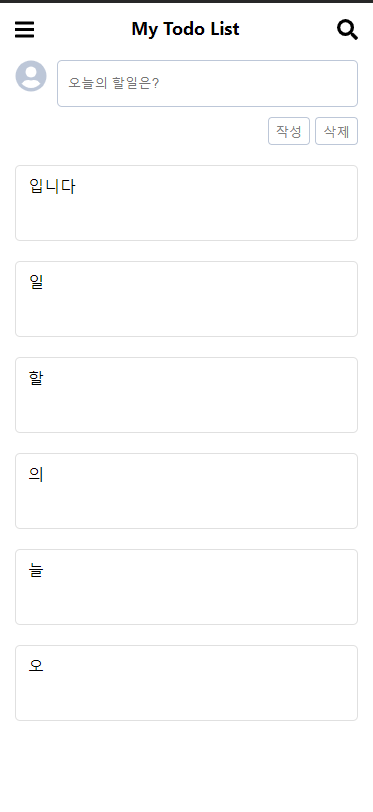
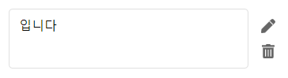
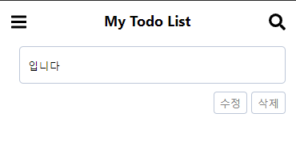
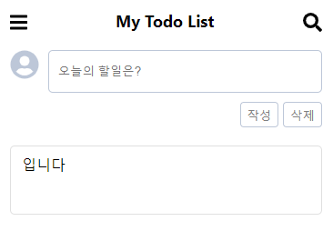

간단한 CRUD 기능이 있는 투두리스트를 만들어 보았습니다.
> demo : https://simsimjae.github.io/react_todolist

> 위 예제는 다음 레포지토리에 저장되어있습니다.  
> 1. git clone https://github.com/simsimjae/react_practice.git  
> 2. get reset --hard dceffe873d8584a26f521453efe8374e6587a99d  
> 3. yarn start or npm run start 실행

조회, 작성 기능은 [1편](https://simsimjae.github.io/posts/react/5)에 작성되어있습니다.

# 삭제 기능 구현

투두 카드에서 삭제 아이콘을 누르면 해당 카드가 삭제되는 기능을 구현해보겠습니다.

## src/components/Card
```jsx
const Card = ({ inputText, cardId }) => {
	const [clicked, setClicked] = useState(false);
	const useAppContext = useContext(AppContext);

	const handleClick = e => {
		setClicked(!clicked);
	};

	const handleRemove = () => {
		const newList = useAppContext.list.filter(({ id }) => {
			return cardId !== id;
		});

		useAppContext.setList(newList);
	};

	return (
		<article className={`card ${clicked ? "on" : ""}`}>
			<div className="card_contents" onClick={handleClick}>
				{inputText}
			</div>
			<div className="card_buttons">
				<button type="button" className="card_button">
					<Link to={`/edit/${cardId}`}>
						<FontAwesomeIcon icon={faPen} size="lg" />
					</Link>
				</button>
				<button type="button" className="card_button">
					<FontAwesomeIcon icon={faTrashAlt} size="lg" onClick={handleRemove} />
				</button>
			</div>
		</article>
	);
};
```
카드 컴포넌트에서 handleRemove 부분을 집중적으로 보겠습니다.
```jsx
const handleRemove = () => {
	const newList = useAppContext.list.filter(({ id }) => {
		return cardId !== id;
	});

	useAppContext.setList(newList);
};
```
AppContext에 들어있는 투두리스트를 순회하면서 컴포넌트로 전달해준 카드의 아이디가 일치하는 리스트를 새로 뽑아서 newList로 만들고
그 리스트를 다시 AppContext에 넣어줬습니다. filter는 새로운 배열을 리턴하기 때문에 불변성이 유지됩니다.
이렇게 삭제기능은 간편하게 구현이 가능합니다.

# 수정 기능 구현
수정 기능은 생각보다 까다롭습니다. 우선은 연필 모양 아이콘을 누르면 URL이 `/react_todolist/edit/[카드아이디]`로 변경되고 해당 URL에 해당하는 컴포넌트가 렌더링 됩니다.


이렇게 기존 인풋 컴포넌트와 비슷한 모양의 EditInput이라는 컴포넌트를 생성했습니다. 아바타 아이콘이 빠지고 작성버튼이 수정버튼으로 변경되었습니다.
해당 카드에 들어있던 텍스트가 이 컴포넌트에 그대로 렌더링 되어야 합니다.('입니다'텍스트) 그렇게 하기 위해서는 연필 아이콘을 눌렀을때 변경된 URL에서 카드의 아이디를 뽑아내고
AppContext의 list에서 방금 뽑아낸 카드 아이디가 일치하는 카드의 내용을 EditInput 컴포넌트로 불러와야 합니다.

그래야 연필버튼이 눌렸을때 해당 카드의 텍스트가 그대로 보여지게 됩니다. 카드의 연필 아이콘 부분은 다음과 같습니다.
```jsx
<Link to={`/edit/${cardId}`}>
	<FontAwesomeIcon icon={faPen} size="lg" />
</Link>
```
 react-router의 Link컴포넌트로 클라이언트 라우팅 하고있습니다.

## src/App.js
```jsx
function App() {
	return (
		<BrowserRouter basename="/react_todolist">
			<AppContextProvider>
				<Layout>
					<Route
						exact
						path="/"
						render={props => (
							<>
								<Input {...props} />
								<CardList {...props} />
							</>
						)}
					/>
					<Route path="/edit" render={props => <Edit {...props} />} />
				</Layout>
			</AppContextProvider>
		</BrowserRouter>
	);
}
```
App.js를 다시 살펴봅시다. 루트 컴포넌트로 BrowserRouter가 있습니다.(basename을 설정하여 기본 url이 https://simsimjae.github.io/react_todolist 와 같이 설정됩니다.)
BrowserRouter로 감싸진 자식들은 클라이언트 라우팅이 가능해집니다.(History API 사용)

만약에 기본 url인 https://simsimjae.github.io/react_todolist로 접속하게 되면
```jsx
<Route
	exact path="/" render={props => (
		<>
			<Input {...props} />
			<CardList {...props} />
		</>
	)}
/>
```
해당 부분이 실행되어 Input 컴포넌트와 CardList 컴포넌트가 화면에 렌더링 되게 됩니다. 그럼 다음과 같이 보여지겠죠

마찬가지로 https://simsimjae.github.io/react_todolist/edit 으로 접근하게 되면 Edit 컴포넌트가 렌더링 되게 됩니다.
```jsx
<Route path="/edit" render={props => <Edit {...props} />} />
```
해당 부분에서 왜 render={} 부분을 썼는지 궁금하신 분이 계실겁니다.
BrowserRouter아래에 보면 AppContextProvider가 존재합니다. 이 Provider로 감싸진 자식들은 context를 사용할수있다고 했었는데요 그냥 다음과 같이 하면 context가 자식 컴포넌트에 전달되지 않습니다.
```jsx
<Route path="/edit" component={<Edit/>} />} />
```
왜냐면, AppContextProvider가 전달하는 context는 Route컴포넌트로 전달되지 Edit컴포넌트로 전달되지 않기 때문입니다. 
Route컴포넌트로 감싸져있지 않았다면 바로 Edit컴포넌트에서 context를 받을수 있었을것입니다.

Edit컴포넌트는 다음과 같이 생겼습니다.
## src/components/Edit
```jsx
const Edit = ({ match }) => {
	return (
		<div>
			<Route
				exact
				path={`${match.path}`}
				render={({ history }) => {
					alert("수정할 할일을 선택해주세요");
					history.push("/");
				}}
			></Route>
			<Route path={`${match.path}/:id`} component={EditInput}></Route>
		</div>
	);
};
```

우리가 투두를 수정하려고 할때 그 투두의 아이디가 필요합니다. 근데 그냥 https://simsimjae.github.io/react_todolist/edit 이렇게 바로 접근된 경우 
잘못 접근된것으로 판단해서 수정할 할일을 선택해주세요 라는 얼럿을 띄우고 메인페이지로 이동시킵니다.
여기서 match라는 props는 react-router가 넣어주는 props입니다. 
```jsx
<Route path={`${match.path}/:id`} component={EditInput}></Route>
```
`match.path`는 경로에 대한 패턴을 나타냅니다.(/edit/:cardId)  
`match.url`은 실제 문자열로된 url을 나타냅니다.(/edit/1)

`match.path`는 Route컴포넌트에 사용되고 `match.url`은 Link컴포넌트에 사용됩니다. 
왜냐면 Route의 path로 전달되는값은 동적으로 여러개가 될수있지만 Link컴포넌트로 이동할때는 딱 하나의 경로로 이동해야하기 때문입니다.
아무튼 https://simsimjae.github.io/react_todolist/edit/1와 같이 이동하면 EditInput이라는 컴포넌트가 렌더링 됩니다.

## src/components/EditInput
EditInput컴포넌트는 위에서 잠깐 소개했듯이, 수정을 위한 인풋입니다. 해당 컴포넌트는 src/components/Input에 기본형 인풋과 함께 들어있습니다.
먼저 jsx부분을 살펴보면
```jsx
<div className="todo">
	<form className="todo_form" onSubmit={handleEdit}>
		<div className="todo_area">
			<input className="todo_input" placeholder="오늘의 할일 수정하기" value={input} onChange={e => setInput(e.target.value)} />
		</div>
		<div className="todo_footer">
			<button className="todo_button">수정</button>
			<button type="button" className="todo_button" onClick={() => setInput("")}>
				삭제
			</button>
		</div>
	</form>
</div>
```
아까전에 봤던 메인페이지에 있는 input과 거의 유사합니다. 다른점은, 작성 -> 수정 텍스트 변경과 onSubmit에서 handleEdit함수가 실행된다는 점입니다.
```jsx
useEffect(() => {
	useAppContext.list.map(item => {
		if (item.id === match.params.id) {
			setInput(item.inputText);
		}
	});
}, []);
```
수정페이지에서는 해당 카드에 들어있던 문자열이 기본적으로 세팅되서 보여져야 합니다.
리액트의 useEffect 훅스를 사용해서 AppContext에 있는 투두리스트중에서 match.params.id(url `/edit/1` 중 카드아이디에 해당하는 `1` 값)와 일치하는 투두를 현재 인풋의 state로 세팅합니다.

그럼 다음과 같이 EditInput 컴포넌트가 화면에 렌더링됨과 동시에 그 카드의 내용이 세팅되겠죠?


수정 버튼이 클릭되면 다음 함수가 호출됩니다.
```jsx
const handleEdit = e => {
	e.preventDefault();
	const { list } = useAppContext;

	const itemIdx = list.findIndex(item => {
		return item.id === match.params.id;
	});

	const newList = [...list.slice(0, itemIdx), { inputText: input, id: nextId() }, ...list.slice(itemIdx + 1)];

	useAppContext.setList(newList);
	history.push("/");
};
```
우선 submit 되었을때 기본적으로 페이지를 새로고침하는 기능을 제거하기 위해서 e.preventDefault()를 실행했습니다.
그리고 나서 AppContext에서 list를 꺼내오고 list에 있는 투두리스트들중에서 현재 match.params.id(카드아이디에 해당됨)와 일치하는 카드의 인덱스를 itemIdx로 가져옵니다.
그리고 나서 다음 부분이 매우 중요합니다.

```jsx
const newList = [...list.slice(0, itemIdx), { inputText: input, id: nextId() }, ...list.slice(itemIdx + 1)];
```
왜 굳이 이렇게 해줬냐면, 불변성을 유지해주기 위해서입니다. immer나 immutable라이브러리를 사용하면 
손쉽게 불변성유지하면서 상태를 변경해줄수있는데 저는 그냥 es6의 spread operators문법을 활용해서 구현했습니다.
먼저 배열의 slice라는 메소드는 startIndex(첫번째인자)에서 개수(두번째 인자)만큼 자른 새로운 배열을 리턴해줍니다.

우리는 itemIdx번째에 있는 투두를 수정할것이기 떄문에 0부터 itemIdx개 만큼 기존 배열을 잘라넣으면 itemIdx번째 투두는 빠지게 되겠죠?
그리고나서 우리가 업데이트할 새로운 객체를 중간에 넣어줍니다.(이렇게 가운데에 넣어주지 않으면 우리가 수정한 투두의 위치가 바뀝니다.)
그리고 우리가 업데이트할 투두 다음번째부터 끝까지를 다시 넣어줍니다.(list.slice(itemIdx + 1) 부분)
이렇게 하면 딱 그 부분만 수정된 새로운 배열 newList를 얻을수있습니다.

그리고 나서 그 newList를 AppContext의 list에 새롭게 세팅해주면 AppContext를 바라보고 있는 다른 컴포넌트들이 새롭게 렌더링 될 것 입니다.
(카드리스트 컴포넌트, 카드 컴포넌트가 순차적으로 리렌더링 되서 우리가 수정한 값이 반영됩니다.)
수정을 하고 나서는 메인페이지로 이동해야하기 때문에 history.push('/')를 해주었습니다.
history와 match는 react-router가 컴포넌트에 넣어준값입니다.

# 결론
비동기 액션이 필요하지 않은 프로젝트의 경우엔 Context API만으로 리액트의 props drilling 문제를 해결할수 있습니다.
기존에 Context API가 사용하기 불편해서 잘 안쓰였지만 버전이 업데이트 되면서 사용하기 쉬워졌고 심지어 훅스가 나온 이후로 useContext를 사용하면 
<Context.Consumer>로 감싸주지 않아도 context를 참조할수있기 떄문에 더더욱 편해졌습니다.


